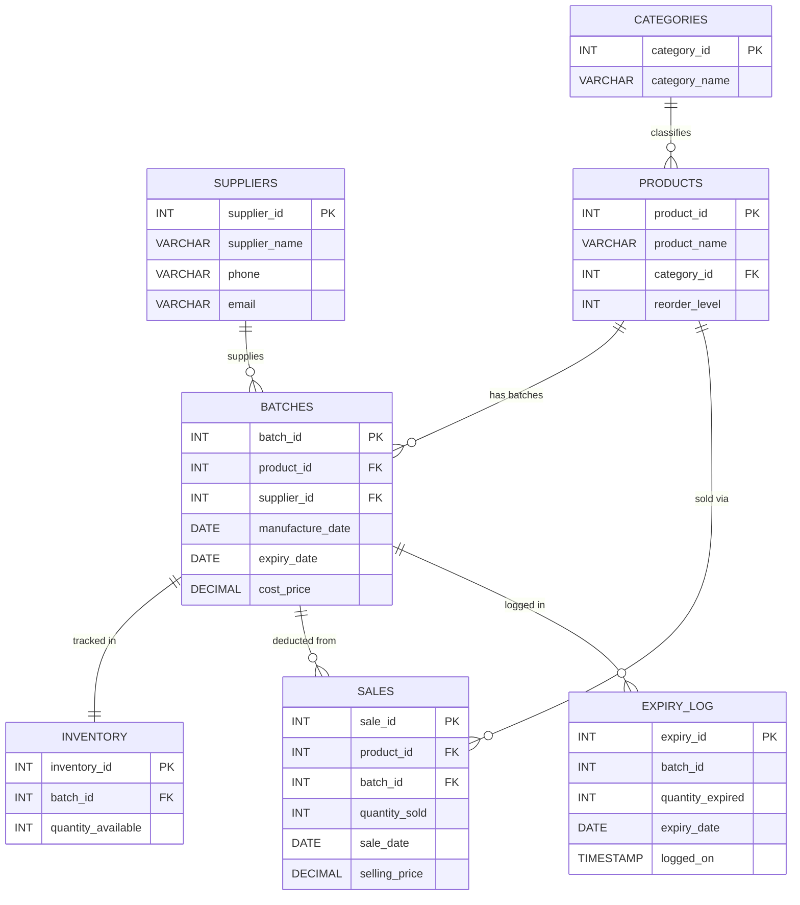

-- ============================================================
-- Smart Inventory & Expiry Management System
-- FILE: database/er_diagram.md
-- Render in VS Code Markdown Preview or GitHub
-- ============================================================

# Smart Inventory — ER Diagram

